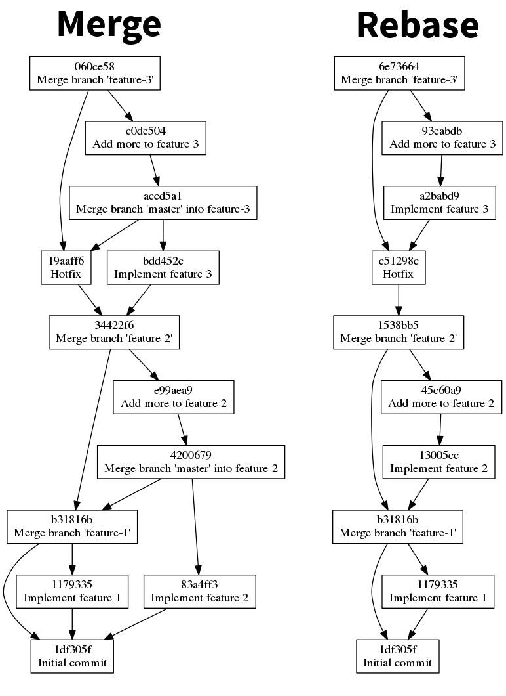

# Merge vs Rebase

A simple example of how merges in Git can create an overly-complex history graph. Or rather, how rebasing enables you to keep a mostly-linear history graph.

## Summary

A common Git workflow is to work on short-lived feature branches, which are merged back into master when the feature is complete. It is a fairly common practice (especially in more active projects) to keep these feature branches up-to-date with master to help prevent conflicts. The correct way to achieve this is (in my opinion) by rebasing -- `git rebase master feature-branch`. However, it is fairly common for people to merge instead -- `git merge master`. This can cause your history graph to become very complex and ugly.

The purpose of this repository is to provide a simple example which demonstrates the difference between the merge and rebase approaches. Below is a visualisation of these differences.

## Analysis

Despite being a trivial example, this easily demonstraights how rebasing can simplify the history graph. Notice how in the rebase version, the most complex parts of the history graph forms a sort-of chain link shape. This is a stark contrast to the merge version which doesn't form any recognisable shape -- it is a confused jumble of merge commits.

In my opinion, the rebase version allows you to clearly spot where feature branches have come from, and where they were merged into master.

## Running the demonstration yourself

This repository contains a script which will set up two Git repositories which demonstrate the differences between merging master into a feature branch, and rebasing the feature branch onto master.

Run `./setup.sh` to get started. This will create two directories: `merge/` and `rebase/`. Each contains a Git repository.

Then inspect the results however you like. For example, try opening two terminals side-by-side and compare the output of `git log --graph --oneline` in the `merge/` and `rebase/` directories.

To generate the graphs displayed above, run `../generate-graph.sh` from either the `merge/` or `rebase/` directory.
